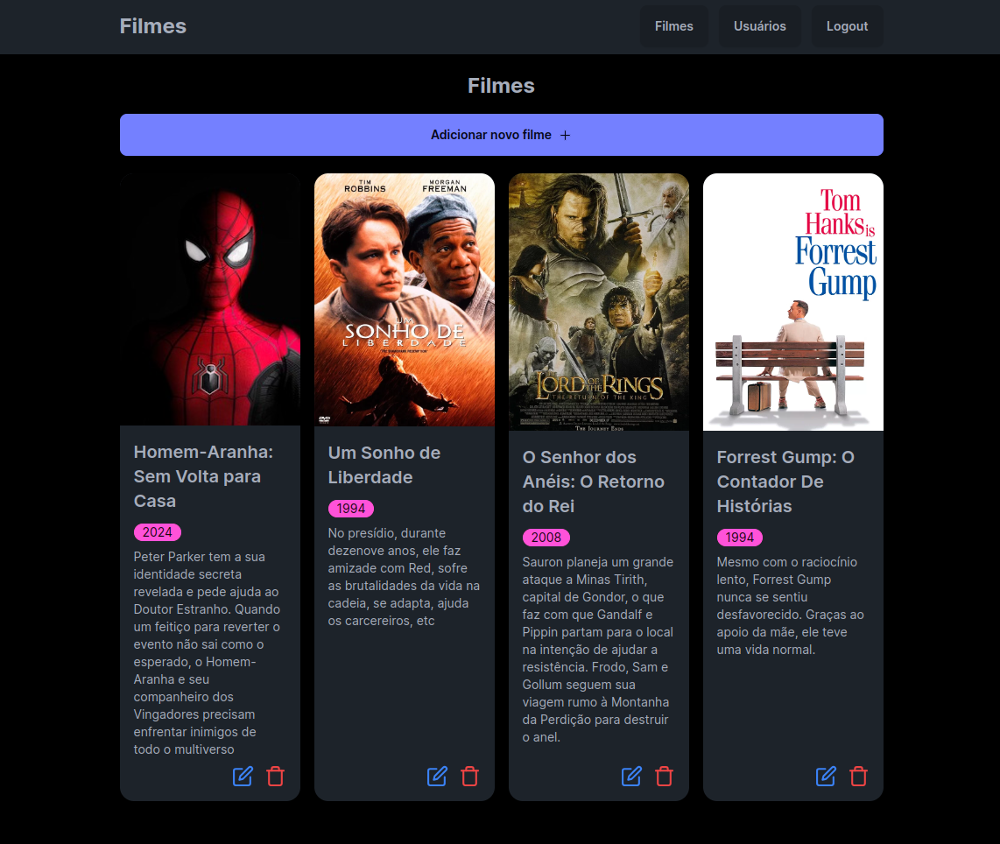
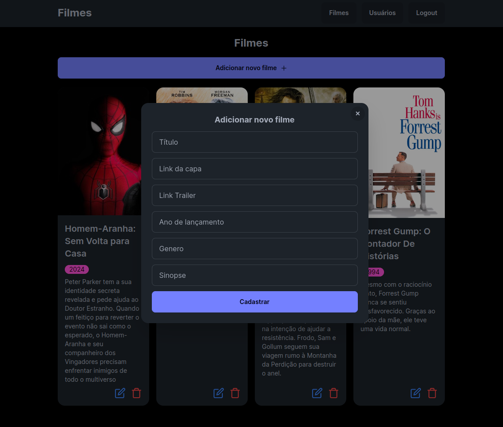
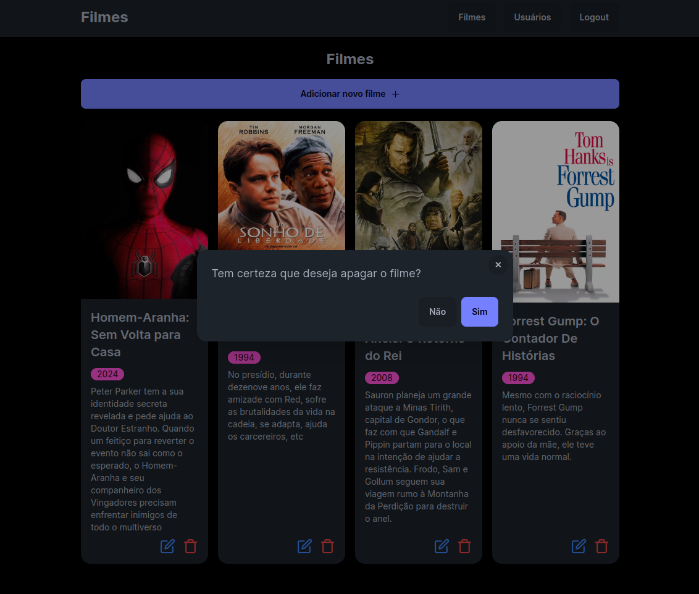
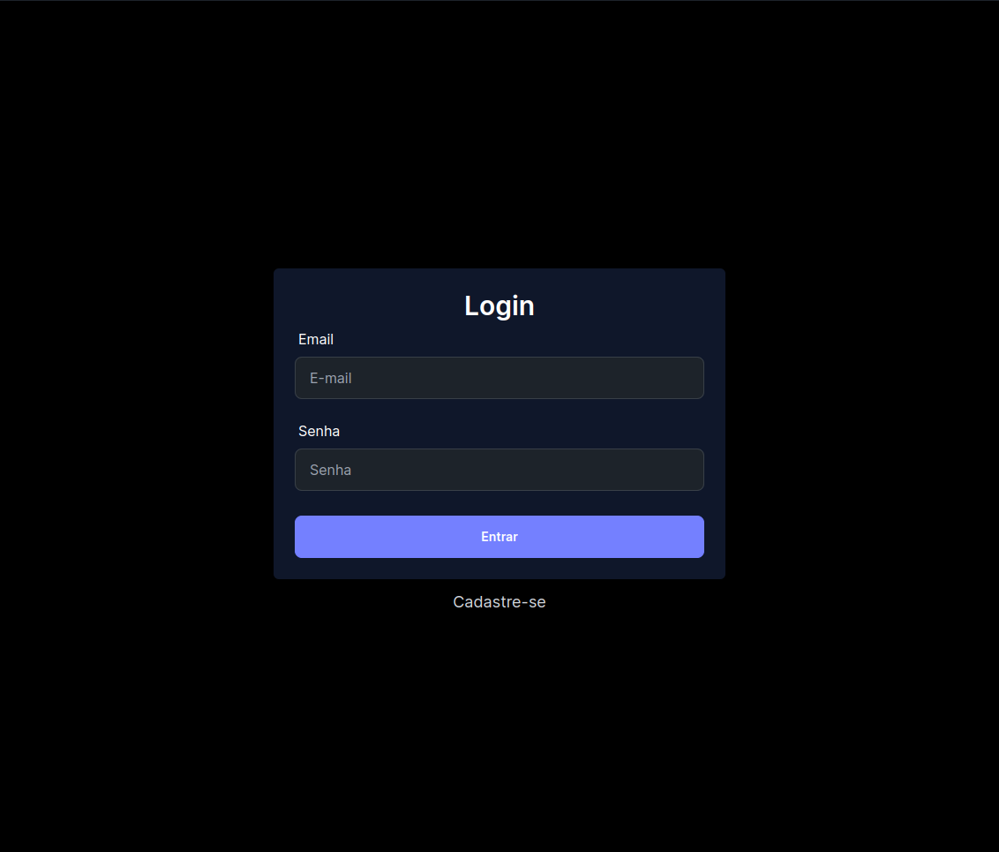
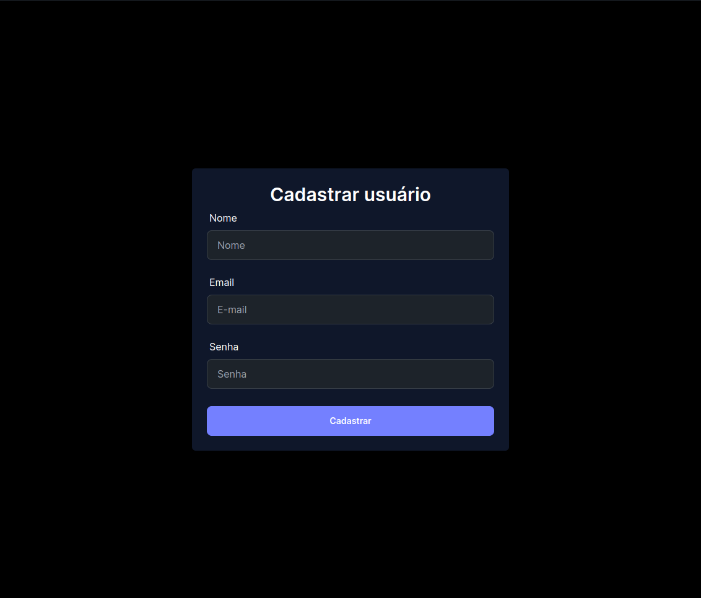
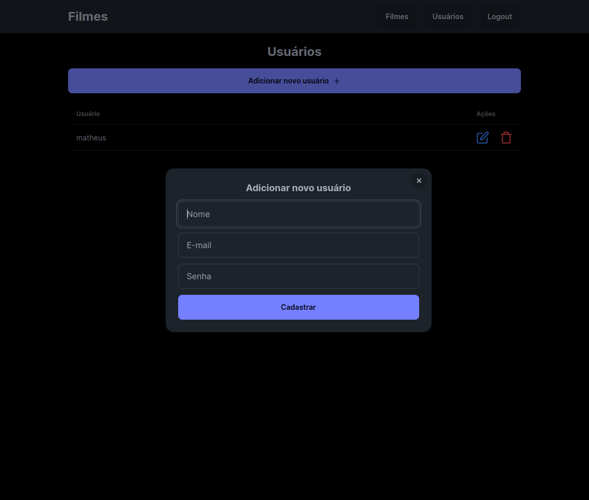

# Teste Desenvolvedor Full Stack













Link deploy vercel: https://fullstack-movies-8tlj26j99-matheus-gomes-projects.vercel.app/

Para subir banco de dados PostgreSQL e Redis:

```
docker compose up -d
```

## Instruções de build backend

Para instalar as dependências:
```
composer install
```

Executar cadastrar tabelas no banco de dados:
```
php artisan migrate
```

Executar o comando para rodar as seeders de gênero dos filmes:
```
php artisan db:seed --class=GenderSeeder
```

Para iniciar o servidor de desenvolvimento:
```
php artisan serve
```

## Instruções de build frontend

Instalar as dependências:
```
npm install
```

Para executar o no modo de desenvolvimento:
```
npm run dev
```

Para executar o no modo de produção:
```
npm run build
```

---

## Instruções do teste

O teste consiste em criar uma aplicação com Backend(Laravel || NodeJS) que expõe uma API REST de um CRUD de usuários e filmes e uma aplicação web contendo uma interface(React/Next.JS) para login e acesso a dados de uma API externa.

## Back-end
    •  Todos os endpoints de consulta de dados devem ter autenticação por Token ou similar

## Front-end
O front-end deverá ser desenvolvido em React deve apresentar pelo menos os seguintes requisitos:
    •  Interface de login
    •  Feedbacks de usuário ou senha incorreta
    •  Listagem dos dados de filmes
    •  Paginação dos dados
    •  Listagem dos dados de Usuários

## Critérios de avaliação
    •  Funcionamento do projeto
    •  Estrutura do código
    •  Uso de boas práticas
    •  Cumprimento dos requisitos mínimos

## Deve ser entregue:
    •  Um repositório git (fork deste)
    •  Criação de um Readme com instruções de build

Não se deve fazer o commit de pastas como node_modules, o projeto deve instalar suas dependências a partir do package.json

## Extras:
    •  Publicação no Vercel.app
    •  Uso de Containers Docker
    •  Uso de Testes
    •  Build para produção
